# MorphoStack

<p align="center">
  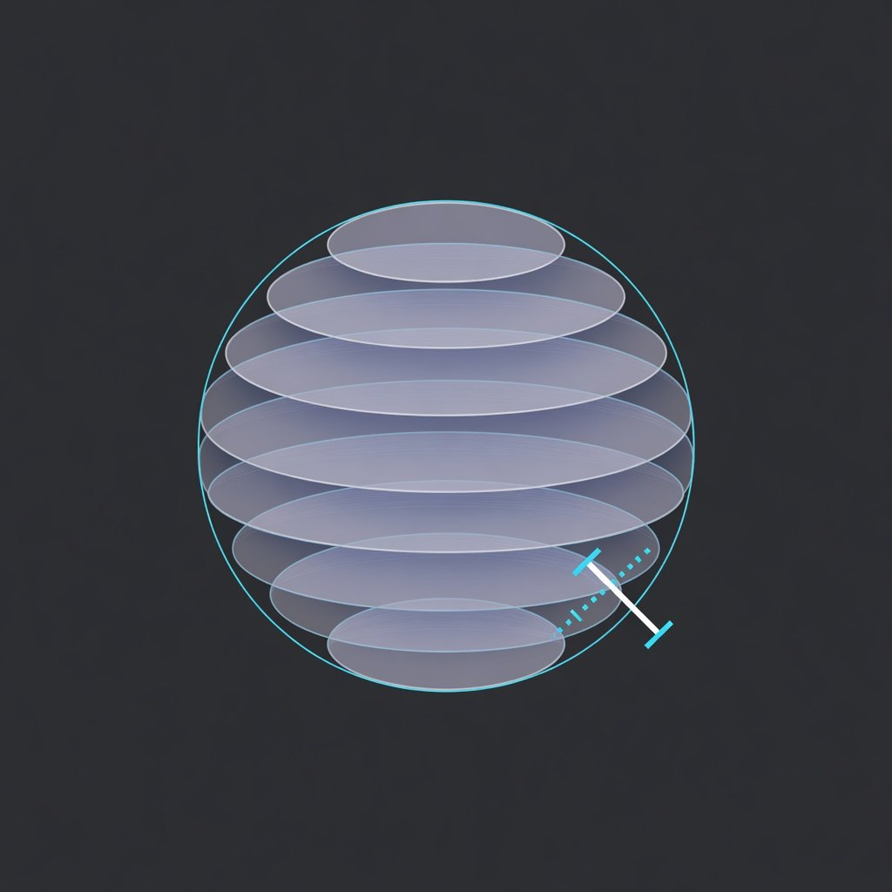
</p>

<p align="center">
  <strong>Local morphometry for microscopy Z-stacks</strong><br/>
  Vesicles · GUVs · RBCs · seeded objects in crowded fields<br/>
  CLI · FastAPI · browser UI · reproducible run bundles
</p>

<p align="center">
  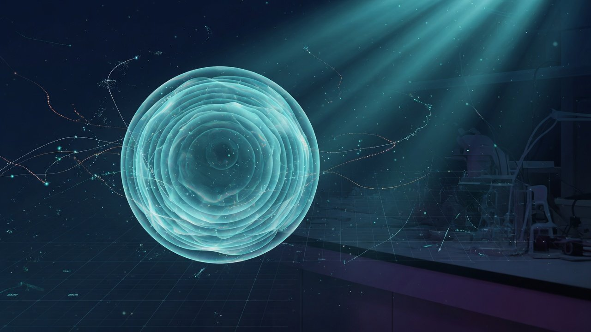
</p>

<p align="center">
  <code>morphostack</code> &nbsp;·&nbsp; short alias <code>mst</code> &nbsp;·&nbsp; v0.1.0<br/>
  <strong>Dual license:</strong> AGPL-3.0-only <em>or</em> PolyForm Noncommercial 1.0.0
</p>

---

## See it before you read it

<table>
  <tr>
    <td width="50%" align="center">
      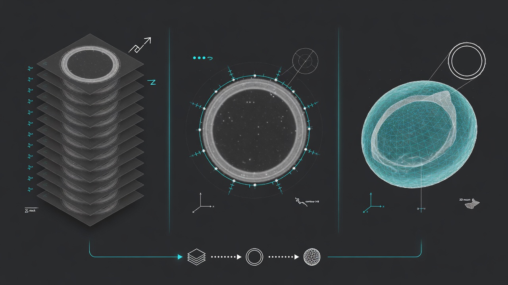<br/>
      <sub><b>Pipeline</b> — stack → seed/contour → mesh metrics</sub>
    </td>
    <td width="50%" align="center">
      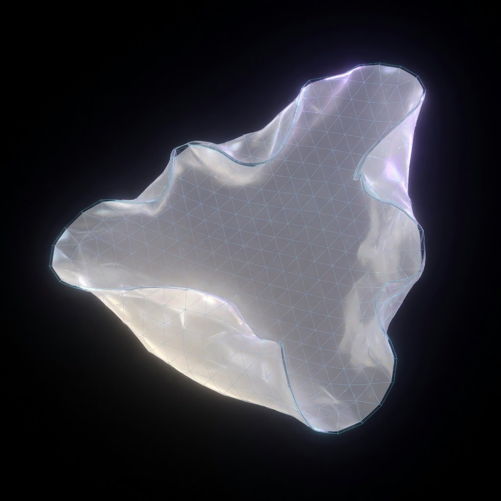<br/>
      <sub><b>Mesh export</b> — OBJ / STL / PLY / GLB</sub>
    </td>
  </tr>
  <tr>
    <td width="50%" align="center">
      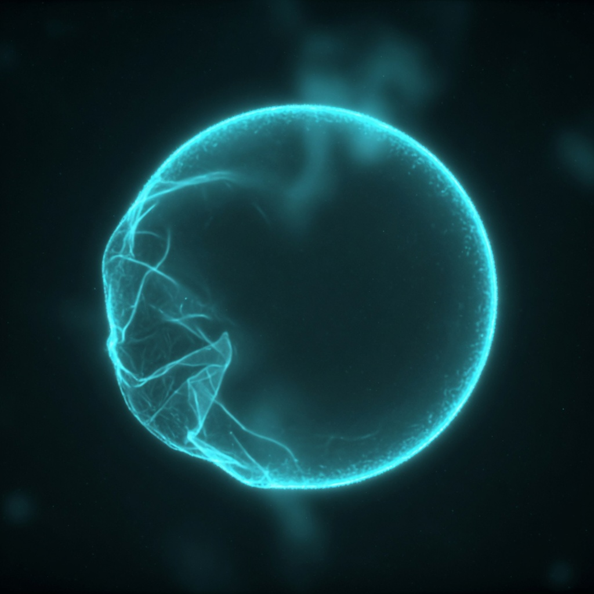<br/>
      <sub><b>Vesicle / GUV profile</b></sub>
    </td>
    <td width="50%" align="center">
      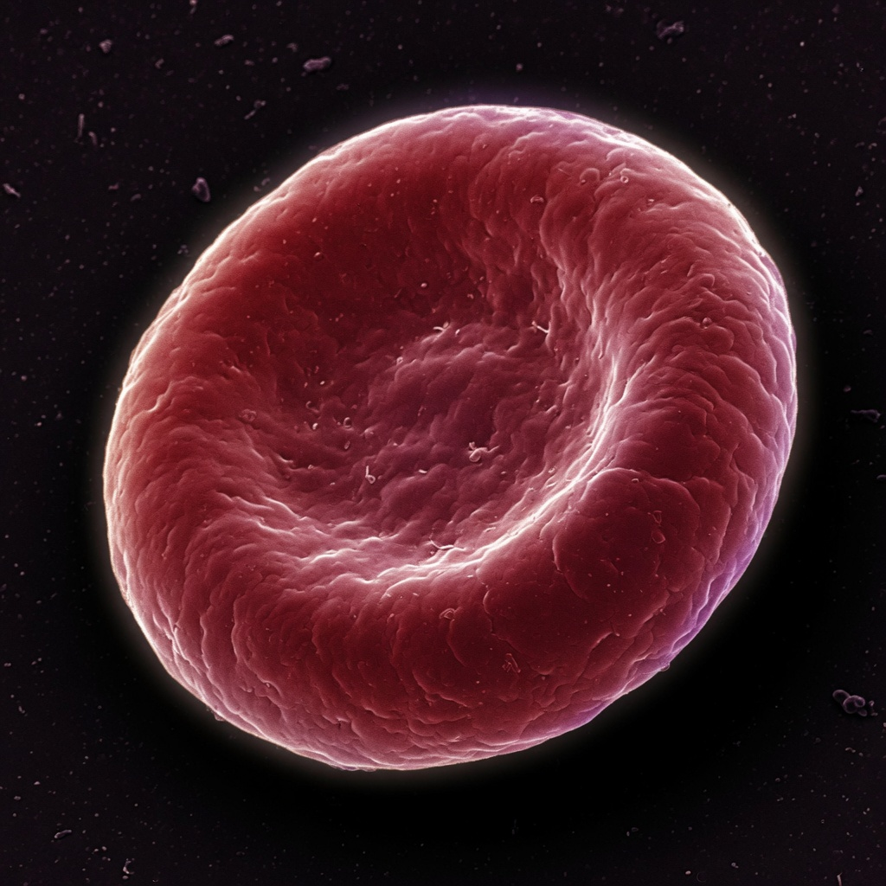<br/>
      <sub><b>RBC profile</b> (shared engine; lab metrics evolving)</sub>
    </td>
  </tr>
  <tr>
    <td width="50%" align="center">
      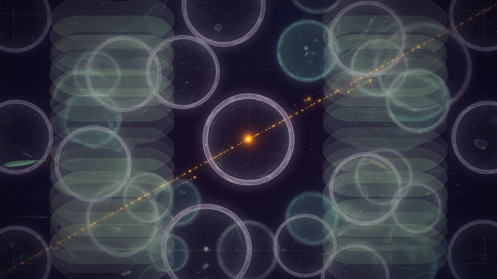<br/>
      <sub><b>Crowded fields</b> — seed one object, track in Z</sub>
    </td>
    <td width="50%" align="center">
      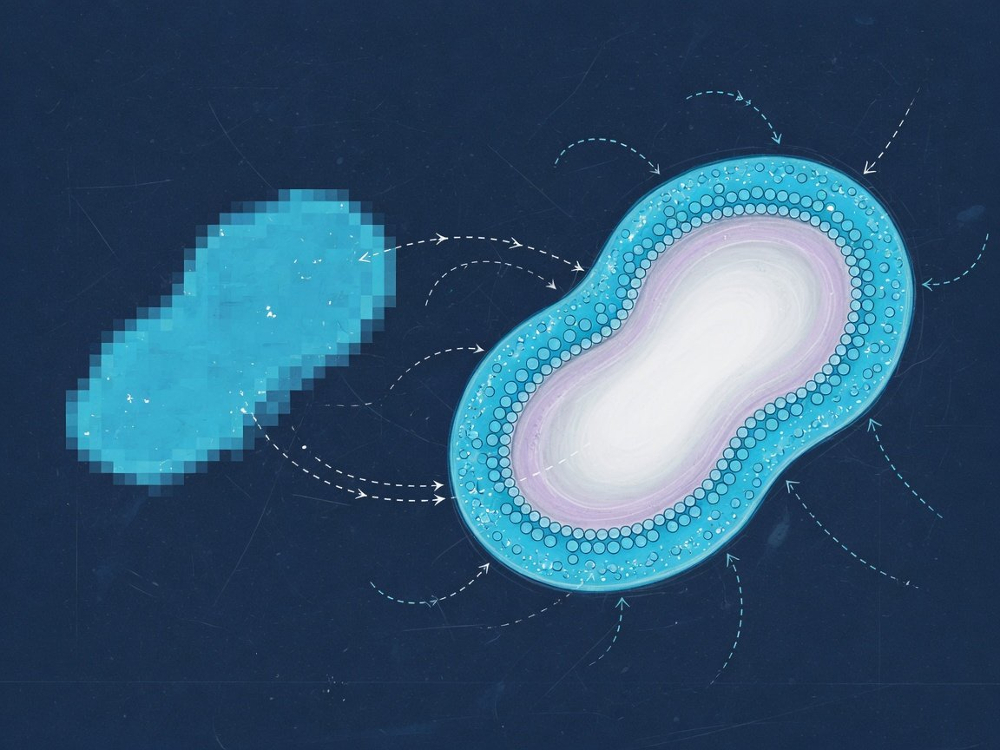<br/>
      <sub><b>Active surfaces</b> — experimental refinement</sub>
    </td>
  </tr>
</table>

### Real validation previews (from the pipeline)

| DOPC vesicle (seeded) | Crowded CZI field | RBC field |
| :---: | :---: | :---: |
| 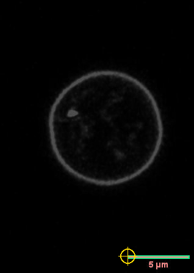 | 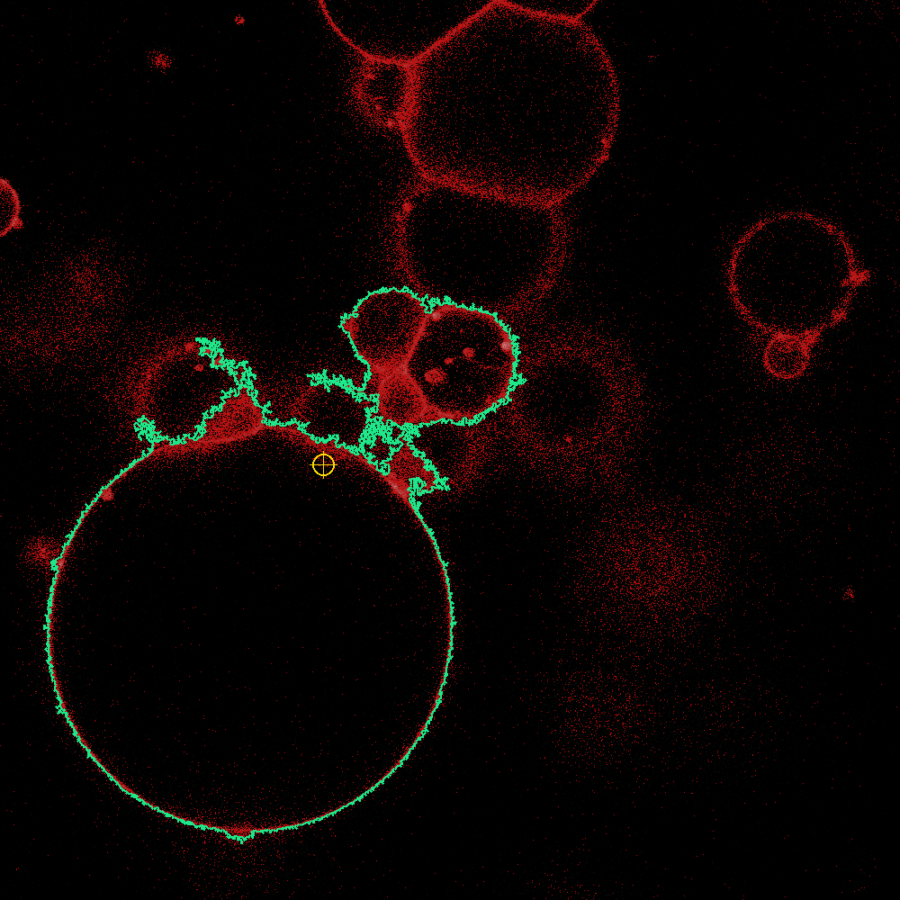 | 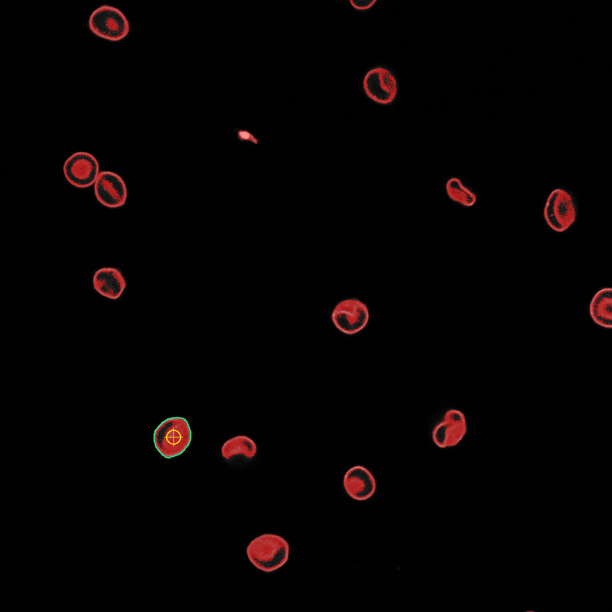 |

These PNGs are **actual MorphoStack outputs** stored under `validation/runs/` — not mockups.

<p align="center">
  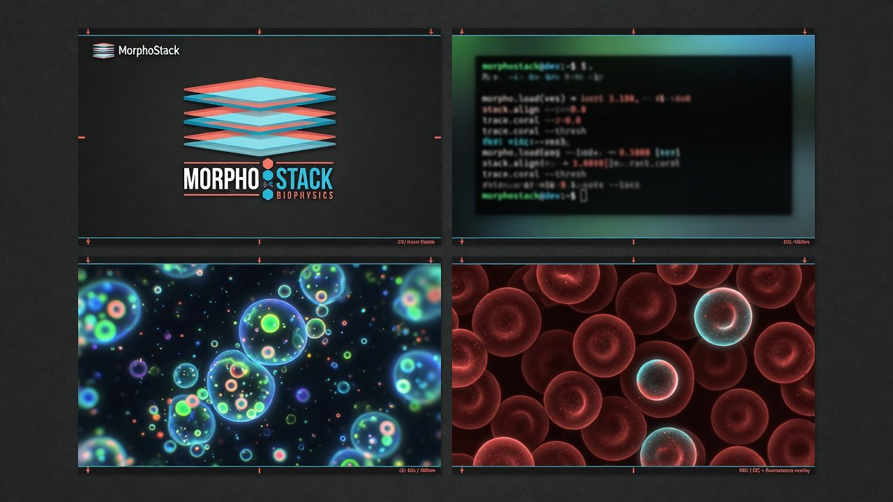
</p>

---

## What it does

MorphoStack turns confocal (and related) **Z-stacks** into **2D shape metrics** and optional **3D surface/volume** measurements — with honest calibration, manifests, and batch workflows built for biophysics lab use.

| Capability | Details |
| --- | --- |
| **Formats** | TIFF/TIF, LSM, CZI |
| **Profiles** | `vesicle`, `rbc`, experimental `active_surfaces` |
| **Selection** | Z-range, rectangular ROI, circle/polygon **object seed**, frame exclusion |
| **Analysis** | Threshold suggestion, sweeps, headless `analyze` / `batch` |
| **3D** | Marching-cubes mesh, preview, export OBJ/STL/PLY/GLB + mask TIFF |
| **Provenance** | SHA-256 source hash, JSON manifests, Markdown reports, CSV validate |
| **Surfaces** | CLI (`morphostack` / `mst`), FastAPI, Vite browser UI |

> **Calibration honesty:** if voxel size is unknown, MorphoStack falls back to 1×1×1 µm and **warns**. Those numbers are geometry in default units — not automatic biology. See [docs/limitations.md](docs/limitations.md).

---

## Quick start

### Install (development)

```bash
git clone https://github.com/sudoax0n/MorphoStack.git
cd MorphoStack
python -m venv .venv

# Windows
.\.venv\Scripts\python -m pip install -e ".[all]"
.\.venv\Scripts\morphostack doctor

# macOS / Linux
source .venv/bin/activate
python -m pip install -e ".[all]"
morphostack doctor
```

Optional browser UI deps:

```bash
morphostack init --web
```

### Commands that matter

Both entry points work (same code path):

```bash
morphostack --version    # MorphoStack 0.1.0
mst --version            # MorphoStack 0.1.0
```

```bash
morphostack doctor
morphostack inspect path/to/stack.tif
morphostack threshold path/to/stack.tif
morphostack analyze path/to/stack.tif --threshold 100 --out metrics.csv --report
morphostack analyze crowded.czi --threshold 190 \
  --seed-x 360 --seed-y 517 --seed-frame 105 \
  --mesh --mesh-export mesh.obj --bundle-dir runs
morphostack batch path/to/stacks --threshold 100 --out batch_summary.csv
morphostack validate reference.csv new.csv
morphostack app          # local UI + API (built web dist)
morphostack dev          # API + Vite hot reload
mst doctor               # short alias
```

---

## Architecture (one engine, three doors)

```text
  CLI (morphostack / mst)  ─┐
  FastAPI backend          ─┼─►  src/morphostack/core/
  Browser UI (apps/web)    ─┘         I/O · segmentation · metrics
                                      mesh · pipeline · export
```

| Path | Role |
| --- | --- |
| `src/morphostack/core/` | Science + pipeline |
| `src/morphostack/cli/` | Command line |
| `src/morphostack/api/` | HTTP API |
| `apps/web/` | TypeScript UI |
| `tests/` | pytest suite (195+) |
| `validation/` | Real + synthetic regression runs |
| `docs/` | Usage, methods, limitations |
| `docs/public/` | README graphics & brand assets |

---

## Robustness you can inspect

- **Synthetic geometry** — sphere & ellipsoid regression under `validation/runs/`
- **Real stacks** — DOPC GUV, crowded CZI, RBC multi-object seeds
- **Touching-object negative case** — documents failure modes honestly
- **Active surfaces vs threshold** comparison reports in `validation/reports/`
- **Wheel packaging** — `scripts/build_wheel.ps1`, `scripts/verify_release_wheel.ps1`

```bash
pytest
# optional heavy real-data tests:
pytest -m slow
```

---

## Documentation map

Full index: **[docs/README.md](docs/README.md)**

| Doc | Topic |
| --- | --- |
| [docs/getting-started.md](docs/getting-started.md) | Install, doctor, first analyze |
| [docs/usage.md](docs/usage.md) | Browser UI + CLI workflows |
| [docs/metrics.md](docs/metrics.md) | Metric definitions |
| [docs/methods.md](docs/methods.md) | Paste-ready methods text |
| [docs/limitations.md](docs/limitations.md) | Scientific caveats |
| [docs/active-surfaces.md](docs/active-surfaces.md) | Experimental profile |
| [docs/validation.md](docs/validation.md) | Regression runs |
| [docs/troubleshooting.md](docs/troubleshooting.md) | Common failures |
| [docs/distribution.md](docs/distribution.md) | Wheels & releases |
| [docs/citations.md](docs/citations.md) | Libraries & data citations |

---

## Scientific lineage

MorphoStack is a **ground-up redesign** of earlier Shape-Analysis tooling used in soft-matter vesicle work, aimed at cleaner units, headless automation, tests, and crowded-field seeding.

When reporting analyses that use public DOPC supplementary stacks, cite the original experimental papers (see [docs/citations.md](docs/citations.md)).

### Cite MorphoStack

If you use this software, please cite it (GitHub: “Cite this repository” / [`CITATION.cff`](CITATION.cff)):

> Abhinav. *MorphoStack: local morphometry toolkit for microscopy Z-stacks* (v0.1.0). 2026. https://github.com/sudoax0n/MorphoStack

Also credit MorphoStack by name in papers, theses, and derivative tools when practical. Library and dataset citations: [docs/citations.md](docs/citations.md).

---

## License

Copyright © 2026 Abhinav.

MorphoStack is **dual-licensed**. You may choose **one**:

| Option | Full text | In short |
| --- | --- | --- |
| **AGPL-3.0-only** | [LICENSE-AGPL-3.0.txt](LICENSE-AGPL-3.0.txt) | Free use, including commercial, **if** you open-source distributions and network-deployed modifications under AGPL |
| **PolyForm Noncommercial 1.0.0** | [LICENSE-POLYFORM-NONCOMMERCIAL-1.0.0.txt](LICENSE-POLYFORM-NONCOMMERCIAL-1.0.0.txt) | Free for **noncommercial** research, education, and personal use — **not** for commercial products |

Summary for humans: [LICENSE](LICENSE).

**Commercial closed-source** (no AGPL source disclosure): contact **ms24115@iisermohali.ac.in** for a separate license.

SPDX: `AGPL-3.0-only OR PolyForm-Noncommercial-1.0.0`

---

<p align="center">
  <br/>
  <sub>Measure the stack. Trust the units. Ship the run.</sub>
</p>
