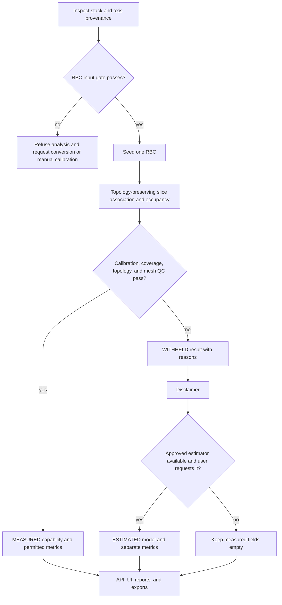

# RBC 3D Morphometry Engineering Program - Plan

> **For agentic workers:** REQUIRED SUB-SKILL: Use `superpowers:subagent-driven-development` or `superpowers:executing-plans` to implement one phase packet at a time. Do not execute the master plan as one undifferentiated change.

**Goal:** Complete the engineering foundation for scientifically honest morphometry of one selected RBC while reserving biological-accuracy claims for later lab validation.

**Architecture:** Route the RBC profile into a topology-preserving core path with explicit calibration, capability, quality-control, and result-authority states. Keep measured, withheld, display-only, and estimated geometry separate through core, API, UI, reports, and exports.

**Tech Stack:** Python 3.11+, NumPy, OpenCV, scikit-image, pytest, FastAPI, TypeScript, Vite, and the existing MorphoStack scientific/display authority types.

## Global Constraints

- Optimize one deliberately selected RBC per run; do not add field-wide RBC quantification.
- Keep the existing `vesicle` and `active_surfaces` behavior unchanged unless a shared fix is required and separately proven safe.
- Do not add Cellpose, StarDist, or another required deep-learning dependency.
- Do not emit calibrated RBC measurements unless X, Y, and Z calibration are individually verified.
- A direct `.lsm` file may be inspected, but RBC analysis and physical exports remain blocked until manual X/Y/Z calibration or verified metadata-preserving TIFF/OME-TIFF conversion is supplied.
- Show a limitation disclaimer before offering estimated geometry; label every estimated value and artifact `ESTIMATED`.
- Never populate measured fields from an estimated model.
- Use static morphology terminology; do not call an RBC deformable without a stress-controlled experiment.
- Treat the supplied research report as scientific authority: `researches/rbc-confocal-z-stack-morphometry-deep-research-2026-08-04.md`.
- Synthetic tests prove algorithms against known geometry; they do not establish biological accuracy.

---

## Goal Capsule

- **Objective:** Deliver the approximately 70% engineering portion that can be completed without new lab data.
- **Product authority:** This plan, the Product Contract below, and the supplied research report govern implementation in that order for product behavior and scientific definitions.
- **Execution profile:** Four sequential engineering packets, followed by one evidence-dependent packet that must not be used to claim the engineering phases are biologically validated.
- **Stop conditions:** Stop a phase if it would invent calibration, discard RBC topology, mix measured and estimated authority, or change GUV behavior without explicit scope expansion.
- **Tail ownership:** The executor for each packet owns its tests, documentation, and handoff evidence; the orchestrator reviews the actual diff before the next packet begins.

---

## Product Contract

### Summary

MorphoStack will gain a genuinely RBC-specific path for one selected confocal Z-stack object. It will report only measurements supported by calibration, acquisition quality, topology, and reconstruction QC, while offering a separate estimated visualization when measured biconcavity is unavailable.

### Problem Frame

The current RBC profile mostly uses the vesicle pipeline. Its seeded slice result stores one external contour and fills holes before 3D meshing, which can erase the central depression of a biconcave RBC and inflate volume. Current calibration warnings also permit placeholder or partially inferred spacing to reach physical outputs.

### Key Decisions

- **Topology-preserving occupancy is the first measured 3D representation.** (session-settled: user-approved - chosen over patching the filled outer-contour mesh: it is the most robust CPU-first foundation.) Governs R5-R8.
- **Upper and lower membrane surfaces are a later validated tier.** (session-settled: user-approved - chosen over making surface fitting the first default: it depends on membrane-resolving acquisition.) Governs R8 and R15.
- **Estimated output follows a disclaimer and stays separate.** (session-settled: user-directed - chosen over withholding all output: the lab still wants a clearly labeled model when measurement is unsupported.) Governs R9-R11.
- **Unverified direct LSM calibration blocks RBC analysis.** (session-settled: user-directed - chosen over warning-only placeholder measurements: physical values must not look authoritative.) Governs R2-R4.
- **The current work targets one RBC.** (session-settled: user-directed - chosen over whole-field quantification: accuracy of the best selected cell is the priority.) Governs R1.

### Requirements

**Input, calibration, and selection**

- R1. RBC measured reconstruction requires one explicit circle or polygon seed and must not silently choose the largest object.
- R2. The system must record independent X, Y, and Z calibration provenance rather than treating a single `voxel_source` label as proof that all axes are valid.
- R3. A direct `.lsm` without manual X/Y/Z calibration must stop RBC analysis and request either manual calibration or verified metadata-preserving TIFF/OME-TIFF conversion.
- R4. Converted TIFF input must still fail the calibration gate when any axis is absent, placeholder-filled, or unverified.

**Measured reconstruction and metrics**

- R5. RBC slice results must preserve an outer loop, zero or more inner loops, and the authoritative occupancy mask used for measurement.
- R6. The RBC path must not call hole filling or single-contour rasterization in a way that removes a supported dimple region.
- R7. Measured 3D output must be withheld when calibration, caps, clipping, association, overlap, topology, or mesh QC fails.
- R8. Capability states must distinguish calibrated 2D contour, validated 3D occupancy, and validated 3D surface output.
- R9. RBC 2D axes must use physical-coordinate second moments and expose `aspect_ratio_L_over_W` and `static_elongation_index`.
- R10. Volume and surface area must come from the accepted topology-preserving occupancy or closed scientific mesh, with an independent volume cross-check.
- R11. Thickness and biconcavity metrics must be emitted only at the capability tier that supports their definitions.

**Estimated, displayed, and exported output**

- R12. When measured biconcavity is unavailable, the UI must show the limitation before an explicit action can reveal an estimated model.
- R13. Estimated geometry must use a distinct type and authority role that cannot become an `AuthoritativeMask` or `ScientificMesh`.
- R14. UI, API, CSV, manifest, report, screenshots, and geometry downloads must preserve `MEASURED`, `ESTIMATED`, or `WITHHELD` status and reasons.

**Reliability and compatibility**

- R15. The engineering release must include deterministic topology, calibration, rotation, anisotropy, authority, and biconcave-phantom tests.
- R16. Existing vesicle and experimental active-surfaces results must remain compatible unless an explicitly reviewed shared contract changes.
- R17. Biological-accuracy, repeatability, and paper-use claims must remain withheld until the evidence-dependent packet passes with real Zeiss stacks and instrument checks.

### Key Flows

- F1. **Inspect and calibrate.** Inspect file and per-axis provenance; direct uncalibrated LSM ends at a conversion/manual-calibration prompt. Covers R2-R4.
- F2. **Select and reconstruct.** User seeds one RBC; the RBC core preserves loop hierarchy and occupancy through Z. Covers R1 and R5-R6.
- F3. **Measure or withhold.** Central QC assigns a capability and either releases measured fields or withholds them with reasons. Covers R7-R11.
- F4. **Offer estimation.** A withheld or lower-tier result shows the disclaimer, then an explicit action may request separate estimated geometry. Covers R12-R13.
- F5. **Export and review.** Every downstream surface displays and serializes the same authority and QC state. Covers R14.

### Acceptance Examples

- AE1. **Covers R3-R4.** Given a direct `.lsm` with no manual override, when the user starts RBC analysis, then analysis stops and offers conversion or complete manual X/Y/Z calibration without returning physical metrics.
- AE2. **Covers R5-R7.** Given an annular slice in a biconcave phantom, when the RBC stack is reconstructed, then the inner loop remains empty and the resulting occupancy passes topology checks.
- AE3. **Covers R7-R8.** Given a selected RBC touching the first Z slice, when QC runs, then complete-volume and surface claims are withheld with a cap-coverage reason.
- AE4. **Covers R12-R14.** Given biconcavity that cannot be measured, when the user accepts the disclaimer and requests estimation, then the viewer and exports label the model `ESTIMATED` and measured fields remain empty.
- AE5. **Covers R9 and R15.** Given the same ellipse at multiple in-plane rotations, when RBC 2D metrics run, then moment-axis measurements remain invariant within the test tolerance.
- AE6. **Covers R16.** Given an existing vesicle regression fixture, when all RBC engineering packets are complete, then its result remains unchanged within the established regression tolerance.

### Scope Boundaries

**Included in the engineering portion**

- Calibration and capability contracts, topology-preserving occupancy, measured RBC metrics, QC, measured/estimated authority separation, UI/API/export integration, review tooling, and synthetic regression.

**Deferred to evidence-dependent work**

- Final estimator formula and population priors, real-stack accuracy thresholds, blinded annotation agreement, bead/PSF and stage calibration, biological repeatability, and Tier-C upper/lower membrane surface fitting.

**Outside this product's current identity**

- Automatic quantification of every RBC in a field and mechanical deformability claims from static images.

### Dependencies and Research

- Canonical science report: `researches/rbc-confocal-z-stack-morphometry-deep-research-2026-08-04.md`.
- Durable capability guidance: `docs/solutions/best-practices/rbc-confocal-morphometry-capability-gates.md`.
- Current limitations: `docs/limitations.md`.
- Product backlog anchor: `improvements.md`.

---

## Planning Contract

### Key Technical Decisions

- KTD1. **Create an RBC-owned result contract before changing meshing.** Add focused RBC models and segmentation modules instead of adding more optional fields to the vesicle slice result. Implements R5-R8 and preserves R16.
- KTD2. **Extend the existing authority chain.** RBC occupancy becomes authoritative only after central QC; scientific meshes derive from accepted occupancy, and display meshes remain derivatives. Implements R7-R8 and R10.
- KTD3. **Use one shared RBC capability evaluator.** API, CLI, batch, report, preview, and export consumers must call the same evaluator instead of recreating warning logic. Implements R2-R4, R7-R8, and R14.
- KTD4. **Use hierarchy/parity for multi-loop slices.** Represent outer and inner loops with explicit hierarchy and reject ambiguous topology instead of filling every detected boundary. Implements R5-R6.
- KTD5. **Treat estimation as a separate provider contract.** Engineering can complete the authority, UI, and serialization path before a production estimator is scientifically approved. Implements R12-R14.

### High-Level Technical Design

### Sequencing

1. [Phase 1 - Capability and calibration](rbc-3d-morphometry/phase-01-capability-and-calibration.md)
2. [Phase 2 - Topology-preserving reconstruction](rbc-3d-morphometry/phase-02-topology-reconstruction.md)
3. [Phase 3 - Morphometry and QC](rbc-3d-morphometry/phase-03-morphometry-and-qc.md)
4. [Phase 4 - Product surfaces and engineering validation](rbc-3d-morphometry/phase-04-product-surfaces-and-validation.md)
5. [Phase 5 - Evidence-dependent validation and surface refinement](rbc-3d-morphometry/phase-05-evidence-dependent-validation.md)

Phase 5 is not required to complete the engineering portion, but it is required before MorphoStack presents the RBC path as biologically validated.

### Risks

- A TIFF suffix does not prove metadata preservation; per-axis provenance and user confirmation must drive calibration status.
- Fluorescence appearance may not separate cell interior from membrane consistently; ambiguous topology must fail closed.
- Surface area is sensitive to axial sampling, threshold, and smoothing; record method parameters and compare mesh with occupancy volume.
- The production estimated-shape formula is not settled by the supplied research; do not invent it during Phases 1-4.
- Current real RBC runs lose many slices and use default spacing; they are stress evidence, not accuracy references.

---

## Implementation Units

### U1. Capability and calibration foundation

- **Goal:** Implement R1-R4 and the shared result-authority vocabulary.
- **Packet:** `docs/plans/rbc-3d-morphometry/phase-01-capability-and-calibration.md`.
- **Depends on:** None.
- **Produces:** Stable calibration assessment, RBC capability types, and fail-closed input gates used by later units.

### U2. Topology-preserving RBC reconstruction

- **Goal:** Implement R5-R6 and route RBC away from the hole-filled vesicle representation.
- **Packet:** `docs/plans/rbc-3d-morphometry/phase-02-topology-reconstruction.md`.
- **Depends on:** U1.
- **Produces:** Loop-aware slice results and a full-resolution occupancy candidate.

### U3. Measured morphometry and QC

- **Goal:** Implement R7-R11 and promote only valid occupancy to scientific measurement authority.
- **Packet:** `docs/plans/rbc-3d-morphometry/phase-03-morphometry-and-qc.md`.
- **Depends on:** U1-U2.
- **Produces:** Rotation-safe metrics, capability assignment, mesh/volume cross-checks, and withholding reasons.

### U4. Product surfaces and engineering validation

- **Goal:** Implement R12-R16 across API, CLI, UI, reports, exports, and deterministic test fixtures.
- **Packet:** `docs/plans/rbc-3d-morphometry/phase-04-product-surfaces-and-validation.md`.
- **Depends on:** U1-U3.
- **Produces:** End-to-end authority-safe UX and the engineering regression gate.

### U5. Evidence-dependent scientific validation

- **Goal:** Satisfy R17 and decide whether Tier-C surface reconstruction and a production estimator are supportable.
- **Packet:** `docs/plans/rbc-3d-morphometry/phase-05-evidence-dependent-validation.md`.
- **Depends on:** U1-U4 plus lab data and acquisition records.
- **Produces:** Biological validation evidence or an explicit decision to keep capabilities withheld.

---

## Verification Contract

| Gate | Applies to | Command or evidence | Pass signal |
| --- | --- | --- | --- |
| Core focused tests | U1-U3 | `.\.venv\Scripts\pytest tests\test_core_io.py tests\test_core_metrics.py tests\test_core_mesh.py tests\test_result_authority.py tests\test_core_pipeline.py` | All focused tests pass. |
| RBC contract tests | U1-U4 | `.\.venv\Scripts\pytest tests\test_rbc_capabilities.py tests\test_rbc_topology.py tests\test_rbc_morphometry.py` | Refusal, topology, metric, QC, and authority cases pass. |
| API/export tests | U4 | `.\.venv\Scripts\pytest tests\test_api.py tests\test_core_export.py -k "rbc or mesh or voxel or calibration or estimated"` | All RBC surface and serialization cases pass. |
| Synthetic validation | U2-U4 | `.\.venv\Scripts\python scripts\validate_rbc_phantoms.py` | The committed tolerance report passes with no unreviewed regression. |
| Web build | U4 | `cd apps\web; npm run build` | TypeScript check and production build pass. |
| Full Python regression | U4 | `.\.venv\Scripts\pytest` | Full suite passes; any Windows temp-directory ACL failure is reported as infrastructure-blocked, not green. |
| Lab validation | U5 | Annotated-stack, repeatability, PSF/bead, and acquisition-record reports under `validation/` | Capability-specific acceptance thresholds pass or remain explicitly withheld. |

---

## Definition of Done

- U1-U4 satisfy R1-R16 and their phase packet exit gates.
- RBC uses a topology-bearing result before measurement; the legacy single-contour mesh is not authoritative for RBC.
- All physical outputs require verified X/Y/Z calibration.
- Measured, estimated, withheld, and display-only roles remain distinct in memory and serialization.
- Existing vesicle regressions remain within their established tolerances.
- The documentation states that Phases 1-4 complete engineering, not biological validation.
- The implementation leaves no abandoned alternate RBC paths or unused experimental flags.
- Phase 5 either passes R17 or records which capabilities remain unavailable and why.
